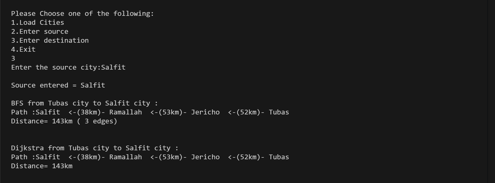

# Graph Algorithms in C

This project implements Graphs in C, reading city data from `cities.txt` and calculating the shortest path distance between two selected cities using both Dijkstra's algorithm and BFS. The results are printed in the `shortest_distance.txt` file.

## File Descriptions

- `Program.c`: Main C program 
- `cities.txt`: Input file containing city names and their distance relationships.
- `shortest_distance.txt`: Output file containing the computed shortest path results.

## Example Usage

To run the program, provide the input file "cities.txt" containing city data and Run the Program.c file , specify the cities to compare:

## Contact

For any inquiries, reach out via:

- Email: [miar.taweel04@gmail.com](mailto\:miar.taweel04@gmail.com)
- GitHub: [miarTaweel](https://github.com/miarTaweel)
